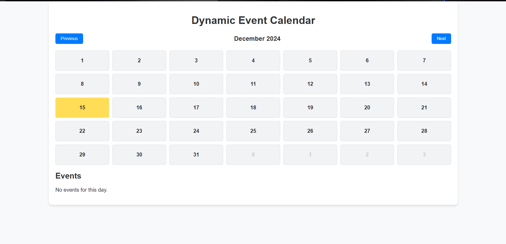
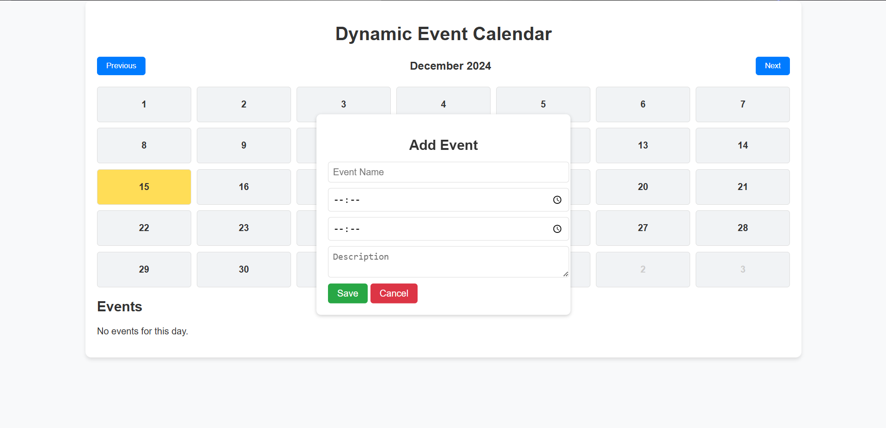
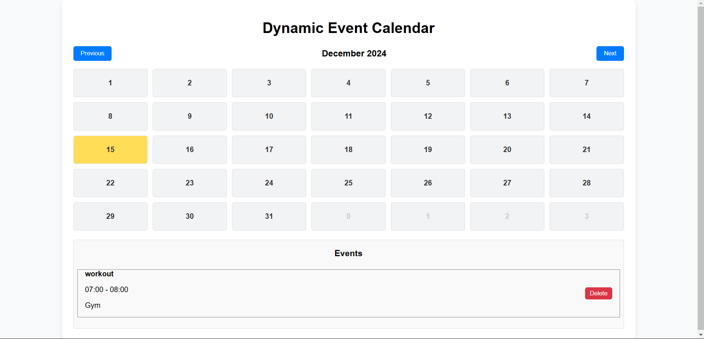

# Dynamic Event Calendar

A dynamic and interactive event calendar built using **React.js**. This project allows users to view, add, delete, and manage events on a calendar. It also includes functionality to export events as JSON or CSV files.

## Features

- **Interactive Calendar Grid**: Navigate and select dates seamlessly.
- **Add Events**: Add event details such as name, time, and description.
- **Delete Events**: Remove unwanted events with a simple action.
- **Persistent Storage**: Events are saved to local storage.
- **Export Functionality**:
  - Export events in **JSON** format.
  - Export events in **CSV** format.
- **Responsive Design**: Works across devices of different screen sizes.

## Folder Structure

```plaintext
src/
├── assets/
├── components/
│   ├── CalendarGrid.jsx   # Displays the interactive 
│   ├── EventModal.jsx     # Modal to add new events
│   ├── EventListPanel.jsx # Displays events for the 
├── utils/
│   ├── dateUtils.js       # Utility for generating 
│   ├── eventUtils.js      # Utility for saving/
├── styles/
│   ├── main.css           # Main stylesheet
├── App.jsx                # Main React component
├── main.jsx               # Renders the React app
└── index.html             # Root HTML file
```

## How to Run the Project

Follow these steps to set up and run the project locally:

1. **Clone the repository**:
   ```bash
   git clone https://github.com/your-username/dynamic-event-calendar.git
   cd dynamic-event-calendar
   ```

2. **Install dependencies**:
   ```bash
   npm install
   ```

3. **Start the development server**:
   ```bash
   npm run dev
   ```

4. **Open in browser**:
   The project will be available at `http://localhost:5173` (default Vite port).

## Technologies Used

- **React.js**: Frontend library for building the UI.
- **Vite**: Fast build tool for modern web projects.
- **CSS3**: Styling for the application.
- **localStorage**: Used for event persistence.
- **FileSaver.js**: For exporting files.
- **json2csv**: Converts event data into CSV format.

## Demo

[Live Demo](https://dynamic-calendar-rakesh-patel57.netlify.app/)

## Screenshots

### Calendar Grid


### Add Event Modal


### Add EventList


## Exporting Events
- Export all events as JSON or CSV files using the provided buttons.

## License

This project is licensed under the MIT License. Feel free to use and modify it for your own purposes.

---

**Author**: [Rakesh Patel](https://github.com/RAKESH-PATEL57)
